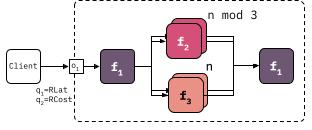

# Generator
The `stepGeneraor` generates AWS StepFunctiuon Configurations based on a scaling factor and deployment template.

## Usage
`python stepGenerator.py <config_file> <sf> <Yes>` will print a uniqu AWS StepFunction Config for the template in `<config_file>` with scaling factor `<sf>` after deploying all functions.

## Template
```
{
    "name":"Unique Name for your deployment",
    "functions":[
        {
            "name":"<unique function-name, should match aws --function name>",
            "type":"<function src, see ../functions>",
            "params":{
                <see MAKEFILE params>
            }
        },
        
    ],
    "flow": [
        #for sequences just use a json object
        {
            "function":"<function-name from above>",
            "repeat":"<any numeric expresion, sf variable availibe>"
        },
        #for a parallel setup use a JSON list
        [
           {
            "function":"<function-name from above>",
            "repeat":"<any numeric expresion, sf variable availibe>"
        },
        ],
    ]
}
```

The following example will generate a configuration based on the following image with two Lloyd functions and a text2speech function in compostion.




``` 
{
    "name":"UCC_Workload",
    "functions":[
        {
            "name":"F1",
            "type":"lloyd",
            "params":{
                "OPSIZE":10000,
                "ITTER":1000,
                "DEPTH":20,
                "NAME":"F3"
            }
        },
        {
            "name":"F2",
            "type":"lloyd",
            "params":{
                "OPSIZE":100000,
                "ITTER":10000,
                "DEPTH":20,
                "NAME":"F2"
            }
        },
        {
            "name":"text2speech",
            "type":"text2speech",
            "params":{}
        }
        
    ],
    "flow": [
        {
            "function":"F1",
            "repeat":"1"
        },
        [
          {
            "function":"F2",
            "repeat":"sf % 3"
          },  
          {
              "function":"text2speech",
              "repeat":"sf"
          }
        ],
        {
            "function":"F1",
            "repeat":"1"
        }
    ]
}
```